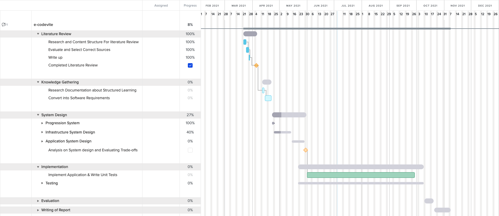
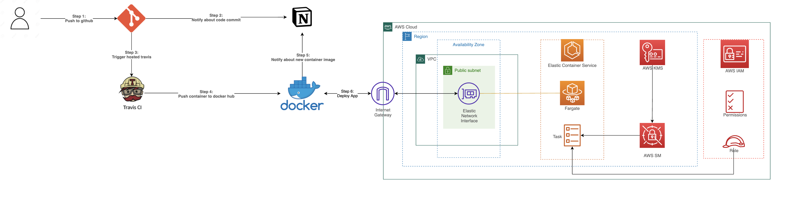

- [Overview](#overview)
- [Total Project Outline - Gantt Chart](#total-project-outline---gantt-chart)
- [System Design](#system-design)
  - [Progression System Outline](#progression-system-outline)
  - [Infrastructure](#infrastructure)
    - [AWS Infrastructure](#aws-infrastructure)
  - [CI/CD Infrastructure](#cicd-infrastructure)
  - [Application](#application)

## Overview 

This project was initially aimed to establish a structured learning environment for candidates who participate in technical interviews ranging from Algorithms and Data Structures to other disciplines within engineering such as Cloud engineers etc. There are websites that provide the function, but the implementation in these platforms allow the individual to bypass any “hand holding” and go straight to complex problems, there is no structure into their progression.

The question has naturally evolved into “Is a structured learning environment or progression system superior to letting individuals have free roam of the platform”. We can answer this question by using a framework:

- How long has the individual candidate taken to progress from “Easy” labelled questions to “Hard”
- From starting at 0, how long has the individual candidate taken to understand the framework for success within this - platform
- What is the success/failure rate of questions that a candidate performs at
- What is the average length of time a candidate remains on the platform 
- Offering a survey comparing the eGuru platform to others

We can use monitoring tools such as Prometheus to monitor the platform infrastructure to analyse data and metrics for conclusion on our framework, we can then use Grafana to provide an easy to understand dashboard/visualisation based on our data, providing we have built a logging system.

## Total Project Outline - Gantt Chart

Although the time estimation for the project has skewed, It still represents the work to be completed for sucessfull software delivery

[Issues Im working on: Notion..](https://www.notion.so/24aed6a0f02c4f3a87ec2ff7a55de317?v=c0db33f39d684cc19f989c2255bdb131)

## System Design

The complete system design that covers everything that contributes to the application's operational ability, Infrastructure, Progression system and Application design. 

### Progression System Outline

*** Need to update ***

### Infrastructure

The overview of the infrastructure from the view of a ci/cd platform to a seamless delivery using AWS. 

#### AWS Infrastructure

*** Need to update ***

### CI/CD Infrastructure

*** Need to update ***

### Application

*** Need to update ***